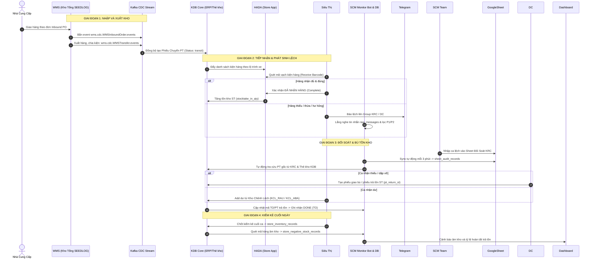

# 📊 BÁO CÁO THỐNG KÊ & PHÂN LUỒNG DỮ LIỆU PHIẾU CHUYỂN VÀ TỒN KHO
**Hệ thống Kingfood SCM Bot & Realtime Audit Dashboard**  
*Thời gian cập nhật: 04/09/2026 17:48:00*

---

## 📌 I. TỔNG QUAN HẠ TẦNG & CƠ SỞ DỮ LIỆU LIÊN QUAN

Trong hệ thống Kingfood SCM, dữ liệu về **Phiếu chuyển (Transfers/PT)** và **Tồn kho (Inventory)** được luân chuyển xuyên suốt qua 4 tầng công nghệ:
1. **WMS & Kafka CDC**: Ghi nhận biến động vật lý tại Kho tổng DC / KRC.
2. **Core ERP KDB API**: Quản lý thẻ kho, danh mục chi nhánh và phiếu chuyển điện tử.
3. **Google Sheets**: Nơi đội ngũ SCM nhập liệu và theo dõi ca lệch hàng ngày.
4. **SQLite Local Database (`scm_monitor.db`)**: Nơi hợp nhất toàn bộ dữ liệu, phục vụ Dashboard tính toán và cảnh báo realtime.

---

## 📈 II. THỐNG KÊ CHI TIẾT CÁC BẢNG CƠ SỞ DỮ LIỆU

### 1. Bảng Dữ Liệu Phiếu Chuyển & Đối Soát (`sheet_audit_records`)
Bảng này lưu trữ toàn bộ các ca phát sinh chênh lệch giữa lượng hàng xuất kho và lượng hàng thực nhận tại siêu thị.

| Chỉ số | Giá trị thống kê | Ghi chú |
| :--- | :--- | :--- |
| **Tổng số dòng dữ liệu** | **6,946** bản ghi | Dữ liệu từ 26/08/2026 đến 04/09/2026 |
| **Số lượng siêu thị phát sinh** | **223** siêu thị | Bao phủ toàn bộ chuỗi Kingfoodmart |
| **Số lượng mặt hàng (SKU)** | **350** mã SKU | Tập trung vào Rau Củ Quả, Trái Cây, Thực Phẩm |
| **Số mã phiếu chuyển (PT)** | **1,888** mã PT gốc | Tra cứu tự động qua KDB API |
| **Số mã phiếu trả tồn ST** | **165** mã PT trả tồn | Các phiếu đã hoàn tất cân tồn |
| **Trạng thái xử lý** | **6,944 Hoàn Thành** (99.97%) | 2 ca đang chờ bổ sung thông tin |

#### Phân loại nguyên nhân lệch phiếu chuyển (`error_type`):
| Phân loại lỗi | Số lượng ca (Dòng) | Tổng sản lượng lệch | Tỷ trọng |
| :--- | :---: | :---: | :---: |
| 🥬 **Hao hụt (Tự nhiên/Cân đo)** | **4,165** ca | **409.36** kg | 59.9% |
| 📦 **DC giao thiếu** | **2,111** ca | **4,808.97** (Kg/Pack) | 30.4% |
| 🚚 **VT giao sai điểm (Vận tải)** | **304** ca | **1,042.10** (Kg/Pack) | 4.4% |
| 🏪 **ST nhập thiếu** | **143** ca | **494.65** (Kg/Pack) | 2.1% |
| 🔄 **DC giao bù** | **84** ca | **559.20** (Kg/Pack) | 1.2% |
| ⚠️ **DC Pick sai mã hàng** | **75** ca | **509.10** (Kg/Pack) | 1.1% |
| 🔍 **ST kiểm sai quy trình** | **55** ca | **13.18** (Kg/Pack) | 0.8% |
| ❓ **Khác (DC thao tác sai, ST ko phản hồi)** | **9** ca | **35.70** (Kg/Pack) | 0.1% |
| **TỔNG CỘNG** | **6,946** ca | **7,872.26** đơn vị | **100%** |

---

### 2. Bảng Dữ Liệu Tồn Kho & Kiểm Kê (`store_inventory_records`)
Lưu trữ dữ liệu kiểm kê thẻ kho chốt ngày của các siêu thị từ KDB API.

| Chỉ số | Giá trị thống kê |
| :--- | :--- |
| **Tổng số bản ghi** | **3,320** bản ghi (31/08/2026 - 04/09/2026) |
| **Số lượng siêu thị tham gia kiểm kê** | **213** siêu thị |
| **Số mặt hàng được kiểm kê** | **376** SKU |
| **Cơ cấu ngành hàng kiểm kê:** | • **Trái Cây**: 2,263 dòng (68.2%) • **Rau Củ Quả**: 984 dòng (29.6%) • **Bánh Tươi / Bakery**: 73 dòng (2.2%) |

#### Các trường dữ liệu cốt lõi của thẻ kho:
- `opening_stock`: Tồn đầu ngày.
- `stocktake_in_qty` & `stocktake_in_value`: Số lượng và giá trị nhập kiểm kê (từ phiếu chuyển PT).
- `stocktake_out_qty` & `stocktake_out_value`: Số lượng và giá trị xuất (bán lẻ / hủy).
- `damage_qty`: Lượng hàng tổn thất, dập vỡ được ghi nhận hủy vật lý.
- `closing_stock`: Tồn kho thực tế cuối ngày sau kiểm kê.

---

### 3. Bảng Theo Dõi Âm Kho Cần Xử Lý (`store_negative_stock_records`)
Ghi nhận các trường hợp siêu thị bị âm tồn kho trên hệ thống KDB.

| Chỉ số | Giá trị thực tế | Ý nghĩa vận hành |
| :--- | :---: | :--- |
| **Tổng số dòng âm kho** | **1,300** bản ghi | Các ca phát sinh trong 5 ngày gần nhất |
| **Số siêu thị bị âm kho** | **187** siêu thị | Cần rà soát phiếu chuyển chưa nhận |
| **Tổng lượng âm kho (`negative_qty`)** | **1,990.89** (Kg/Pack) | Số lượng bán âm trước khi phiếu PT về |
| **Tổng giá trị tiền âm kho** | **88,716,986 VNĐ** | ~88.7 triệu đồng cần bù tồn |

---

## 🔄 III. SƠ ĐỒ PHÂN LUỒNG DỮ LIỆU END-TO-END

---

## 🎯 IV. NGUYÊN TẮC CÂN ĐỐI TỒN KHO & ĐỐI SOÁT CHUẨN

1. **Quy tắc tính Tổng Lượng Lệch Phiếu Chuyển**:
   $$\text{Tổng SL Lệch} = \sum (\text{Hàng Đóng Gói Pack/Vỉ/Cái}) + \sum (\text{Hàng Cân Ký KG})$$
   - Hàng Pack: 1 đơn vị đếm = 1 Pack (Ví dụ thiếu 2 gói hành lá = 2).
   - Hàng KG: 1 kg = 1 đơn vị đếm (Ví dụ thiếu 0.35 kg bưởi = 0.35).

2. **Quy tắc công nhận DONE (Trả tồn thành công)**:
   - Một ca lệch trên `sheet_audit_records` chỉ được đánh dấu là **ĐÃ TRẢ TỒN XONG** khi thỏa mãn ít nhất một trong các điều kiện:
     - Có mã phiếu trả tồn về ST (`pt_return_st`).
     - Có mã phiếu trả tồn về DC (`pt_return_dc`).
     - Có ghi chú xác nhận đã trả tồn theo đơn TO của SCM/KFM.

3. **Cơ chế liên kết Thẻ kho KCL (Kho Chênh Lệch)**:
   - Đối với ca nhận dư, hệ thống tự động kiểm tra xem ST có làm phiếu add dư từ 2 kho chênh lệch chuẩn:
     - **Kho Chênh Lệch Rau**: ID `6982f5f1d360600007807f7b`
     - **Kho Chênh Lệch ABA (Đông Mát)**: ID `691189c10be6a5000755e9bc`
